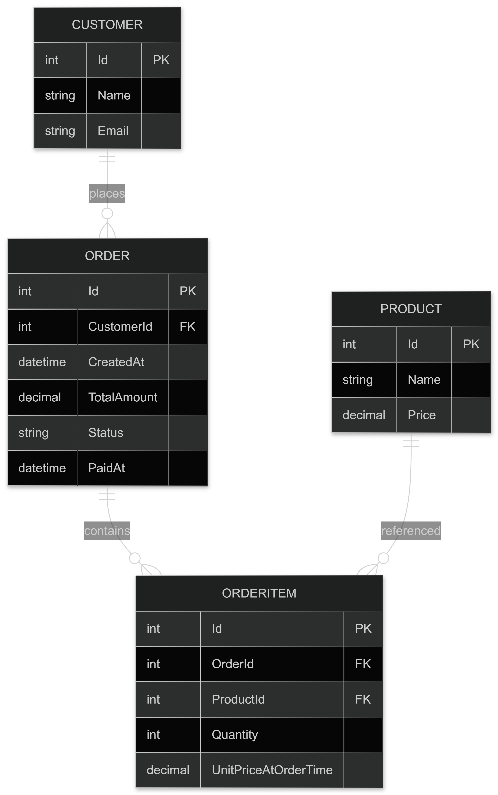

# 📦 OrderFinanceControl

Projeto backend desenvolvido em **.NET** para controle de pedidos financeiros, utilizando duas abordagens de persistência:

* [**SQL Server (Entity Framework Core)**](https://github.com/JoaoVitorAguiar/order-finance-control) → modelo relacional tradicional
* [**MongoDB**](https://github.com/JoaoVitorAguiar/order-finance-control/tree/mongo-db) → modelo orientado a documentos

O objetivo foi comparar abordagens de banco relacional e NoSQL em um mesmo domínio.

## 🚀 Executando com Docker Compose

O projeto possui um `docker-compose.yml` na raiz para subir a API, o SQL Server e o MongoDB com menos configuração manual.

```bash
docker compose up --build
```

Serviços expostos:

* API: `http://localhost:8080`
* Scalar/OpenAPI: `http://localhost:8080/api-docs`
* SQL Server: `localhost,1433`
* MongoDB: `mongodb://localhost:27017`

Nesta branch, a API usa o MongoDB via `MongoSettings`, apontando para o serviço `mongodb`. O SQL Server também sobe no compose para manter a comparação entre as duas abordagens e facilitar a execução cruzada das branches.

> A senha padrão do SQL Server no compose é `Your_strong_password123`. Para trocar, defina a variável `SQLSERVER_SA_PASSWORD` antes de subir os containers.

Se você estiver na branch SQL Server, as migrations do EF Core continuam sendo aplicadas manualmente:

```bash
dotnet ef database update --project OrderFinanceControl
```


## 🔵 SQL Server

Utilizado com **Entity Framework Core**:

* Estrutura relacional normalizada
* Uso de chaves estrangeiras
* Integridade referencial

**Principais entidades:**

* Customer
* Product
* Order
* OrderItem

### 📊 Diagrama Entidade-Relacionamento (DER)
<p align="center">
  
</p>

### 🔎 Exemplo de consulta com Entity Framework Core

Em um banco relacional, mesmo uma consulta aparentemente simples pode envolver múltiplos relacionamentos.

No exemplo abaixo, ao buscar um pedido completo com cliente e itens, o Entity Framework Core precisa resolver internamente **joins entre várias tabelas**: `Orders`, `Customers`, `OrderItems` e `Products`.

```csharp
public async Task<OrderResponseDto?> GetByIdAsync(int id)
{
    return await _dbContext.Orders
        .AsNoTracking()
        .Select(o => new OrderResponseDto
        {
            Id = o.Id,

            Customer = new CustomerResponseDto
            {
                Id = o.Customer.Id,
                Name = o.Customer.Name
            },

            CreatedAt = o.CreatedAt,
            TotalAmount = o.TotalAmount,
            Status = o.Status.ToString(),

            Items = o.Items.Select(i => new OrderItemResponseDto
            {
                ProductId = i.ProductId,
                ProductName = i.Product.Name,
                Quantity = i.Quantity,
                UnitPriceAtOrderTime = i.UnitPriceAtOrderTime
            }).ToList()
        })
        .FirstOrDefaultAsync(o => o.Id == id);
}
```

Apesar de o código em C# parecer simples e expressivo, o EF Core traduz essa expressão LINQ para SQL. A consulta abaixo é uma representação simplificada e didática do tipo de SQL gerado, não uma cópia literal do comando final emitido pelo EF Core. A query real pode variar conforme versão do EF Core, provider, projeção, filtros e estratégia de carregamento.

```sql
SELECT o.Id,
       o.CreatedAt,
       o.TotalAmount,
       o.Status,
       c.Id AS CustomerId,
       c.Name AS CustomerName,
       i.ProductId,
       p.Name AS ProductName,
       i.Quantity,
       i.UnitPriceAtOrderTime
FROM Orders o
INNER JOIN Customers c ON o.CustomerId = c.Id
LEFT JOIN OrderItems i ON i.OrderId = o.Id
LEFT JOIN Products p ON i.ProductId = p.Id
WHERE o.Id = @id;
```

Ou seja, para montar um único objeto `OrderResponseDto`, o banco precisa:

* Consultar a tabela `Orders`
* Realizar join com `Customers`
* Realizar join com `OrderItems`
* Realizar join com `Products`

Essa abordagem garante **forte consistência e integridade referencial**, mas pode envolver consultas mais complexas e múltiplos joins para recuperar dados relacionados.


## 🟢 MongoDB

O **MongoDB** foi utilizado como banco NoSQL orientado a documentos, onde os dados são armazenados em formato **BSON (Binary JSON)**. Diferente de bancos relacionais, ele permite uma estrutura mais flexível e otimizada para leitura de objetos completos.

Principais características dessa abordagem:

* Dados armazenados em formato JSON/BSON
* Estrutura flexível (schema dinâmico)
* Alta performance para leitura de documentos
* Possibilidade de documentos embutidos (*embedding*) ou referências (*referencing*)


### Documentos embutidos (Embedding)

Consiste em armazenar dados relacionados dentro do próprio documento.
Isso reduz a necessidade de múltiplas consultas e melhora a performance de leitura.

Exemplo utilizado no projeto:

```json
{
  "_id": "ObjectId",
  "customer": {
    "_id": "ObjectId",
    "name": "string",
    "email": "string"
  },
  "items": [
    {
      "productId": "string",
      "productName": "string",
      "unitPrice": "decimal",
      "quantity": "int"
    }
  ],
  "createdAt": "datetime",
  "status": "string",
  "paidAt": "datetime?"
}
```

Nesse caso:

* Os dados do **customer** estão embutidos no pedido
* Os **items** também fazem parte do mesmo documento
* O nome e preço do produto são armazenados como *snapshot* no momento da compra

Essa estratégia é útil quando:

* Os dados são frequentemente consultados juntos
* A performance de leitura é prioridade
* Queremos preservar histórico (ex.: preço do produto na data da compra)


### Referência de documentos (Referencing)

Outra abordagem seria armazenar apenas o ID dos dados relacionados:

```json
{
  "customerId": "ObjectId",
  "productIds": ["ObjectId"]
}
```

Nesse caso:

* Os dados completos ficam em outras collections
* Pode ser necessário fazer múltiplas consultas ou usar agregações (`$lookup`)

Essa estratégia é indicada quando:

* Os dados são muito grandes ou frequentemente atualizados
* Há reutilização intensa entre documentos
* A normalização é desejada


### Escolha da abordagem

Não existe uma única abordagem correta.
A escolha entre **embedding** e **referencing** depende principalmente de:

* Volume e frequência de leitura
* Necessidade de consistência dos dados
* Complexidade das consultas
* Evolução do domínio do sistema

No contexto deste projeto, optou-se por **embedding** para os pedidos, visando:

* Melhor performance de leitura
* Simplicidade nas consultas
* Preservação do histórico dos dados relacionados


## ⚖️ Comparativo SQL Server vs MongoDB

| Característica      | SQL Server           | MongoDB                        |
| ------------------- | -------------------- | ------------------------------ |
| Tipo de banco       | Relacional           | Documento (NoSQL)              |
| Schema              | Fixo                 | Flexível                       |
| Relacionamentos     | FK / JOIN            | Embed ou referência            |
| Performance leitura | Boa com joins        | Muito rápida sem joins         |
| Escalabilidade      | Vertical             | Horizontal                     |
| Evolução do modelo  | Migration necessária | Alteração simples              |


## 🧠 Quando usar cada um

### SQL recomendado quando:

* Forte integridade de dados
* Regras financeiras complexas
* Relatórios e consultas analíticas

### MongoDB recomendado quando:

* Alta escala
* Leitura rápida de documentos completos
* Modelo flexível


## ✅ Estratégia de Validação

A validação foi separada em dois níveis, cada um com uma responsabilidade diferente:

* **DTOs de entrada** usam **Data Annotations** para validar dados recebidos pela API, como obrigatoriedade, tamanho máximo, e-mail válido, valores mínimos e listas com pelo menos um item.
* **Mapeamento do banco** usa **Fluent API** no `OrderFinanceControlDbContext` para definir regras de persistência do SQL Server, como nomes de tabelas, chaves primárias, relacionamentos, índices únicos, tamanho de colunas, precisão decimal, conversão de enum e comportamento de delete.

Essa separação evita misturar validação de contrato HTTP com configuração do modelo relacional. As Data Annotations ajudam o ASP.NET Core a recusar payloads inválidos antes da execução dos casos de uso, enquanto a Fluent API garante que o schema do SQL Server continue consistente com as regras de persistência.

Exemplos de Data Annotations nos DTOs:

```csharp
public record ProductDto
{
    [Required]
    [MaxLength(150)]
    public required string Name { get; set; }

    [Required]
    [Range(0.01, 999999999)]
    public decimal Price { get; set; }
}
```

```csharp
public record OrderDto
{
    [Required]
    [Range(1, int.MaxValue, ErrorMessage = "CustomerId must be greater than 0.")]
    public int CustomerId { get; set; }

    [Required]
    [MinLength(1, ErrorMessage = "Order must have at least one item.")]
    public List<OrderItemDto> Items { get; set; } = new();
}
```

Exemplos de Fluent API no mapeamento relacional:

```csharp
entity.Property(p => p.Name)
    .IsRequired()
    .HasMaxLength(150);

entity.Property(p => p.Price)
    .HasColumnType("decimal(18,2)")
    .IsRequired();

entity.HasIndex(p => p.Name)
    .IsUnique();
```

Regras de negócio que dependem de consulta ou estado do sistema continuam nos casos de uso, como verificar se um cliente existe antes de criar um pedido, se produtos existem, ou se um pedido já foi pago. Ou seja: DTO valida formato e limites básicos, Fluent API valida o schema relacional e os casos de uso validam comportamento de negócio.


## 📂 Estrutura do Projeto

O projeto foi mantido intencionalmente em **um único projeto**, com organização por responsabilidade técnica.  
Como o objetivo principal é comparar a modelagem e persistência entre **SQL Server e MongoDB no mesmo domínio**, uma solução com vários projetos adicionaria mais cerimônia do que benefício neste momento.

A separação lógica foi organizada da seguinte forma:


```
OrderFinanceControl/
│
├── Controllers/        → Camada de apresentação (endpoints HTTP)
├── UseCases/           → Regras de aplicação e orquestração de operações
├── Entities/           → Entidades de domínio
├── Enums/              → Tipos e estados do domínio
│
├── Data/
│   ├── Repositories/
│   │   ├── Interfaces/ → Contratos de persistência
│   │   └── Mongo/      → Implementações para MongoDB
│   ├── Configurations/ → Mapeamentos BSON
│   └── MongoContext.cs
│
├── Dtos/               → Objetos de transporte organizados por feature
├── Extensions/         → Métodos de extensão para injeção de dependências
├── Middlewares/        → Tratamento global de exceções
└── Settings/           → Configurações do MongoDB
```

A organização mantém uma separação conceitual entre apresentação, aplicação, domínio e persistência, mesmo dentro de um único projeto. Isso deixa o código simples para estudo e mentoria, mas ainda evita que controllers, regras de aplicação e acesso a dados fiquem misturados.

Nesta fase, a separação por pastas é suficiente porque:

* O domínio é pequeno e cabe em poucos fluxos principais
* A aplicação tem uma única API como ponto de entrada
* A comparação entre SQL Server e MongoDB é mais importante do que a arquitetura da solução
* Os testes conseguem exercitar os casos de uso sem exigir fronteiras físicas entre assemblies

Em outros contextos utilizo Clean Architecture com múltiplos projetos separados por camada.
Neste caso, a decisão de manter tudo em um único projeto foi intencional, priorizando a clareza da comparação entre as abordagens relacional (SQL Server) e NoSQL (MongoDB) no mesmo domínio.

Separar em múltiplos projetos faria mais sentido quando o sistema começasse a exigir fronteiras mais rígidas, por exemplo:

* Regras de domínio crescendo e precisando ficar independentes de ASP.NET Core, EF Core ou MongoDB
* Mais de uma interface consumindo os mesmos casos de uso, como API HTTP, workers, filas ou CLI
* Times diferentes mantendo camadas diferentes da solução
* Necessidade de publicar bibliotecas internas reutilizáveis
* Testes de domínio e aplicação precisando rodar com dependências mínimas
* Persistência SQL, MongoDB ou integrações externas evoluindo de forma independente

Nesse cenário, uma possível divisão seria `Domain`, `Application`, `Infrastructure` e `Api`, mantendo dependências apontando de fora para dentro.


## 🧩 Aderência do Domínio ao Banco

No MongoDB, a entidade pode ser representada quase exatamente como foi modelada no domínio:

```csharp
public class Order(Customer customer, IEnumerable<OrderItem> items)
{
    public string Id { get; set; }
    public Customer Customer { get; set; } = customer;
    public List<OrderItem> Items { get; set; } = items.ToList();
    public decimal TotalAmount => Items.Sum(i => i.Quantity * i.UnitPrice);
}
```

O pedido já contém o cliente e os itens, mantendo a estrutura natural do objeto.

No SQL Server, a modelagem relacional exige algumas adaptações, como a inclusão de chave estrangeira:

```csharp
public class Order
{
    private Order() { }
    public Order(int customerId, ICollection<OrderItem> items)
    {
        CustomerId = customerId;
        Items = items;
        TotalAmount = items.Sum(i => i.Quantity * i.UnitPriceAtOrderTime);
    }

    public int Id { get; set; }
    public int CustomerId { get; set; }
    public Customer Customer { get; set; } 
    public DateTime CreatedAt { get; set; } = DateTime.UtcNow;
    public decimal TotalAmount { get; set; }
    public OrderStatus Status { get; set; } = OrderStatus.Created;
    public DateTime? PaidAt { get; set; }
    public ICollection<OrderItem> Items { get; set; }
}
```

A propriedade `CustomerId` existe por exigência do modelo relacional, não do domínio.

Assim, o MongoDB permite maior proximidade com o modelo orientado a objetos, enquanto o SQL Server exige adaptação para manter integridade referencial.


## TODO

- [x] Adicionar `docker-compose.yml` para subir a API, SQL Server e MongoDB com menos setup manual.
- [x] Ajustar a explicação da query SQL para deixar claro que ela é uma representação simplificada do SQL gerado pelo EF Core.
- [x] Documentar melhor a decisão da estrutura de pastas e quando faria sentido separar em múltiplos projetos.
- [x] Revisar a estratégia de validação e deixar explícito o uso de Data Annotations nos DTOs e Fluent API no mapeamento do banco.
- [ ] Adicionar testes de integração para validar endpoints e persistência real.


